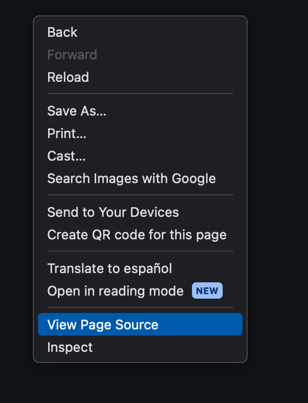
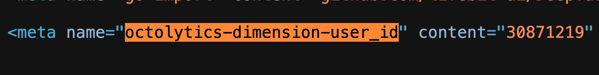
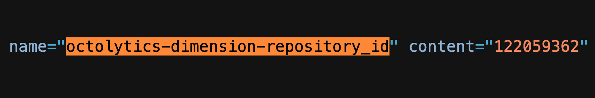
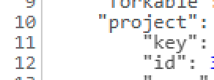

# cloudos-cli

[](https://github.com/lifebit-ai/cloudos-cli/actions/workflows/ci.yml)

Python package for interacting with CloudOS

## Requirements

The package requires Python >= 3.9 and the following python packages:

```
click>=8.0.1
pandas>=1.3.4
numpy>=1.26.4
requests>=2.26.0
rich_click>=1.8.2
```

## Installation

### Docker image
It is recommended to install it as a docker image using the `Dockerfile`
and the `environment.yml` files provided.

To run the existing docker image at `quay.io`:

```bash
docker run --rm -it quay.io/lifebitaiorg/cloudos-cli:latest
```

### From PyPI
The repository is also available from [PyPI](https://pypi.org/project/cloudos-cli/):

```bash
pip install cloudos-cli
```

### From Github

You will need Python >= 3.7 and pip installed.

Clone the repo and install it using pip:

```bash
git clone https://github.com/lifebit-ai/cloudos-cli
cd cloudos-cli
pip install -r requirements.txt
pip install .
```

> NOTE: To be able to call the `cloudos` executable, ensure that the local clone of the `cloudos-cli` folder is included in the `PATH` variable ,using for example the command `export PATH="/absolute/path/to/cloudos-cli:$PATH"`.

## Configuration

Configuration will be saved in the $HOME path folder regardless of operating system. Here, a new folder named `.cloudos` will be created, with files `credentials` and `config` also being created. The structure will look like:

```console
$HOME
  └── .cloudos
        ├── credentials     <-- holds API key
        └── config          <-- holds all other parameters
```

### Configure default profile

To facilitate the reuse of required parameters, profiles can be created. 

In order to generate a profile called `default`, the following command can be used:

```console
cloudos configure
```

This will bring in prompts for API, platform URL, project name, platform executor, repository provider, workflow name (if any). This will be the default profile if no other was explicitly set. The default profile allows running all subcommands without adding `--profile` option in the command line.

### Configure named profile

In order to generate a named profile, the following command can be used:

```console
cloudos configure --profile {profile-name}
```

The same prompts as before will apear. If there is already a profile with the same name, the set parameters will appear in square brackets, where they can be overwritten or left unmodified by pressing Enter/Return.

> [!NOTE]
> When there is already at least 1 previous profile defined, a new question will appear asking to make the current profile as default

### Change the default profile

This can be achieved with:

```console
cloudos configure --profile {other-profile} --make-default
```

### List profiles

At any time it can be seen how many profiles are present and which is the default:

```console
cloudos configure list-profiles
```

The response will look like:

```console
Available profiles:
 - default (default)
 - second-profile
 - third-profile
```

### Remove profile

Any profile can be remove with:

```console
cloudos configure remove-profile --profile second-profile
```

## Usage

The package is meant to be used both as a CLI tool and as a regular package to
import to your own scripts.

### Usage as a Command Line Interface tool

To get general information about the tool:

```bash
cloudos --help
```
```console
Usage: cloudos [OPTIONS] COMMAND [ARGS]...

  CloudOS python package: a package for interacting with CloudOS.

Options:
  --version  Show the version and exit.
  --help     Show this message and exit.

Commands:
  cromwell  Cromwell server functionality: check status, start and stop.
  job       CloudOS job functionality: run and check jobs in CloudOS.
  project   CloudOS project functionality: list projects in CloudOS.
  workflow  CloudOS workflow functionality: list workflows in CloudOS.
``` 

This will tell you the implemented commands. Each implemented command has its
own subcommands with its own `--help`:

```bash
cloudos job run --help
```
```console
Options:
  -k, --apikey TEXT               Your CloudOS API key  [required]
  -c, --cloudos-url TEXT          The CloudOS url you are trying to access to.
                                  Default=https://cloudos.lifebit.ai.
  --workspace-id TEXT             The specific CloudOS workspace id.
                                  [required]
  --project-name TEXT             The name of a CloudOS project.  [required]
  --workflow-name TEXT            The name of a CloudOS workflow or pipeline.
                                  [required]
  --job-config TEXT               A config file similar to a nextflow.config
                                  file, but only with the parameters to use
                                  with your job.
  -p, --parameter TEXT            A single parameter to pass to the job call.
                                  It should be in the following form:
                                  parameter_name=parameter_value. E.g.: -p
                                  input=s3://path_to_my_file. You can use this
                                  option as many times as parameters you want
                                  to include.
  --nextflow-profile TEXT         A comma separated string indicating the
                                  nextflow profile/s to use with your job.
  --nextflow-version [22.10.8|24.04.4|latest]
                                  Nextflow version to use when executing the
                                  workflow in CloudOS. Please, note that
                                  versions above 22.10.8 are only DSL2
                                  compatible. Default=22.10.8.
  --git-commit TEXT               The exact whole 40 character commit hash to
                                  run for the selected pipeline. If not
                                  specified it defaults to the last commit of
                                  the default branch.
  --git-tag TEXT                  The tag to run for the selected pipeline. If
                                  not specified it defaults to the last commit
                                  of the default branch.
  --job-name TEXT                 The name of the job. Default=new_job.
  --resumable                     Whether to make the job able to be resumed
                                  or not.
  --do-not-save-logs              Avoids process log saving. If you select
                                  this option, your job process logs will not
                                  be stored.
  --spot                          [Deprecated in 2.11.0] This option has been
                                  deprecated and has no effect. Spot instances
                                  are no longer available in CloudOS.
  --batch                         [Deprecated in 2.7.0] Since v2.7.0, the
                                  default executor is AWSbatch so there is no
                                  need to use this flag. It is maintained for
                                  backwards compatibility.
  --ignite                        This flag allows running ignite executor if
                                  available. Please, note that ignite executor
                                  is being deprecated and may not be available
                                  in your CloudOS.
  --job-queue TEXT                Name of the job queue to use with a batch
                                  job.
  --instance-type TEXT            The type of execution platform compute
                                  instance to use. Default=c5.xlarge(aws)|Stan
                                  dard_D4as_v4(azure).
  --instance-disk INTEGER         The amount of disk storage to configure.
                                  Default=500.
  --storage-mode TEXT             Either 'lustre' or 'regular'. Indicates if
                                  the user wants to select regular or lustre
                                  storage. Default=regular.
  --lustre-size INTEGER           The lustre storage to be used when
                                  --storage-mode=lustre, in GB. It should be
                                  1200 or a multiple of it. Default=1200.
  --wait-completion               Whether to wait to job completion and report
                                  final job status.
  --wait-time INTEGER             Max time to wait (in seconds) to job
                                  completion. Default=3600.
  --wdl-mainfile TEXT             For WDL workflows, which mainFile (.wdl) is
                                  configured to use.
  --wdl-importsfile TEXT          For WDL workflows, which importsFile (.zip)
                                  is configured to use.
  -t, --cromwell-token TEXT       Specific Cromwell server authentication
                                  token. Currently, not necessary as apikey
                                  can be used instead, but maintained for
                                  backwards compatibility.
  --repository-platform TEXT      Name of the repository platform of the
                                  workflow. Default=github.
  --execution-platform [aws|azure|hpc]
                                  Name of the execution platform implemented
                                  in your CloudOS. Default=aws.
  --hpc-id TEXT                   ID of your HPC, only applicable when
                                  --execution-platform=hpc.
                                  Default=660fae20f93358ad61e0104b
  --cost-limit FLOAT              Add a cost limit to your job. Default=30.0
                                  (For no cost limit please use -1).
  --accelerate-file-staging       Enables AWS S3 mountpoint for quicker file
                                  staging.
  --use-private-docker-repository
                                  Allows to use private docker repository for
                                  running jobs. The Docker user account has to
                                  be already linked to CloudOS.
  --verbose                       Whether to print information messages or
                                  not.
  --request-interval INTEGER      Time interval to request (in seconds) the
                                  job status. For large jobs is important to
                                  use a high number to make fewer requests so
                                  that is not considered spamming by the API.
                                  Default=30.
  --disable-ssl-verification      Disable SSL certificate verification.
                                  Please, remember that this option is not
                                  generally recommended for security reasons.
  --ssl-cert TEXT                 Path to your SSL certificate file.
  --help                          Show this message and exit.
```

#### Send a job to CloudOS

First, configure your local environment to ease parameters input. We will
try to submit a small toy example already available.

```bash
MY_API_KEY="xxxxx"
CLOUDOS="https://cloudos.lifebit.ai"
WORKSPACE_ID="xxxxx"
PROJECT_NAME="API jobs"
WORKFLOW_NAME="rnatoy"
JOB_PARAMS="cloudos_cli/examples/rnatoy.config"
```

As you can see, a file with the job parameters is used to configure the
job. This file could be a regular `nextflow.config` file or any file with the
following structure:

```
params {
    reads   = s3://lifebit-featured-datasets/pipelines/rnatoy-data
    genome  = s3://lifebit-featured-datasets/pipelines/rnatoy-data/ggal_1_48850000_49020000.Ggal71.500bpflank.fa
    annot   = s3://lifebit-featured-datasets/pipelines/rnatoy-data/ggal_1_48850000_49020000.bed.gff
}
```

To submit our job:

```bash
cloudos job run \
    --cloudos-url $CLOUDOS \
    --apikey $MY_API_KEY \
    --workspace-id $WORKSPACE_ID \
    --project-name "$PROJECT_NAME" \
    --workflow-name $WORKFLOW_NAME \
    --job-config $JOB_PARAMS \
    --resumable
```

In addition, parameters can also be specified using the command-line `-p` or `--parameter`. For instance,
the previous command is equivalent to:

```bash
cloudos job run \
    --cloudos-url $CLOUDOS \
    --apikey $MY_API_KEY \
    --workspace-id $WORKSPACE_ID \
    --project-name "$PROJECT_NAME" \
    --workflow-name $WORKFLOW_NAME \
    --parameter reads=s3://lifebit-featured-datasets/pipelines/rnatoy-data \
    --parameter genome=s3://lifebit-featured-datasets/pipelines/rnatoy-data/ggal_1_48850000_49020000.Ggal71.500bpflank.fa \
    --parameter annot=s3://lifebit-featured-datasets/pipelines/rnatoy-data/ggal_1_48850000_49020000.bed.gff \
    --resumable
```

> NOTE: options `--job-config` and `--parameter` are completely compatible and complementary, so you can use a
`--job-config` and adding additional parameters using `--parameter` in the same call.

If everything went well, you should see something like:

```console
Executing run...
	Job successfully launched to CloudOS, please check the following link: https://cloudos.lifebit.ai/app/advanced-analytics/analyses/62c83a1191fe06013b7ef355
	Your assigned job id is: 62c83a1191fe06013b7ef355
	Your current job status is: initializing
	To further check your job status you can either go to https://cloudos.lifebit.ai/app/advanced-analytics/analyses/62c83a1191fe06013b7ef355 or use the following command:
    cloudos job status \
        --apikey $MY_API_KEY \
        --cloudos-url https://cloudos.lifebit.ai \
        --job-id 62c83a1191fe06013b7ef355
```

As you can see, the current status is `initializing`. This will change
while the job progresses. To check the status, just apply the suggested
command.

Another option is to set the `--wait-completion` parameter, which run the same
job run command but waiting for its completion:

```bash
cloudos job run \
    --cloudos-url $CLOUDOS \
    --apikey $MY_API_KEY \
    --workspace-id $WORKSPACE_ID \
    --project-name "$PROJECT_NAME" \
    --workflow-name $WORKFLOW_NAME \
    --job-config $JOB_PARAMS \
    --resumable \
    --wait-completion
```

When setting this parameter, you can also set `--request-interval` to a bigger number (default is 30s) if the job is quite large. This will ensure that the status requests are not sent too close from each other and recognized as spam by the API.

If the job takes less than `--wait-time` (3600 seconds by default), the
previous command should have an output similar to:

```console
Executing run...
	Job successfully launched to CloudOS, please check the following link: https://cloudos.lifebit.ai/app/advanced-analytics/analyses/62c83a6191fe06013b7ef363
	Your assigned job id is: 62c83a6191fe06013b7ef363
	Please, wait until job completion or max wait time of 3600 seconds is reached.
	Your current job status is: initializing.
	Your current job status is: running.
	Your job took 420 seconds to complete successfully.
```

#### Send a bash job to CloudOS (sequential sample processing)

A bash job can be sent to CloudOS using the command `bash` and the subcommand `job`. In this case, the `--workflow-name` must be a bash job already
present in the platform. Bash jobs are identified by bash icon (unlike Nextflow jobs, which are identified with Nextflow icon).

```bash
WORKFLOW_NAME="ubuntu"  # This should be a bash workflow
cloudos bash job \
    --cloudos-url $CLOUDOS \
    --apikey $MY_API_KEY \
    --workspace-id $WORKSPACE_ID \
    --project-name "$PROJECT_NAME" \
    --workflow-name $WORKFLOW_NAME \
    --parameter -test_variable=value \
    --parameter --flag=activate \
    --parameter send="yes" \
    --job-name $JOB_NAME \
    --command "echo 'send' > new_file.txt" \
    --resumable
```
The `--command` parameter is required and will setup the command for the parameters to run.

Each `--parameter` can have a different prefix, either '--', '-', or '', depending on the use case. These can be used as many times as needed.

> [!NOTE]
> At the moment only string values are allowed to the `--parameter` options, adding a filepath at the moment does not upload/download the file. This feature will be available in a future implementation.

If everything went well, you should see something like:

```console
CloudOS bash functionality.

        Job successfully launched to CloudOS, please check the following link: https://cloudos.lifebit.ai/app/advanced-analytics/analyses/682622d09f305de717327334
        Your assigned job id is: 682622d09f305de717327334

        Your current job status is: initializing
        To further check your job status you can either go to https://cloudos.lifebit.ai/app/advanced-analytics/analyses/682622d09f305de717327334 or use the following command:
        cloudos job status \
                --apikey $MY_API_KEY \
                --cloudos-url https://cloudos.lifebit.ai \
                --job-id 682622d09f305de717327334
```

As you can see, the current status is `initializing`. This will change
while the job progresses. To check the status, just apply the suggested
command.

Other options like `--wait-completion` are also available and work in the same way as for the `cloudos job run` command.
Check `cloudos bash job --help` for more details.

#### Abort single or multiple jobs from CloudOS

Aborts jobs in the CloudOS workspace that are either running or initialising. It can be used with one or more job IDs provided as a comma separated string using the `--job-ids` parameter.

Example:
```console
cloudos job abort \
    --cloudos-url $CLOUDOS \
    --apikey $MY_API_KEY \
    --workspace-id $WORKSPACE_ID \
    --job-ids "680a3cf80e56949775c02f16"


Aborting jobs...
        Job 680a3cf80e56949775c02f16 aborted successfully.
```


#### Executor support

CloudOS supports [AWS batch](https://www.nextflow.io/docs/latest/executor.html?highlight=executors#aws-batch) executor by default.
You can specify the AWS batch queue to
use, from the ones available in your workspace (see [here](#get-a-list-of-the-available-job-queues))
by specifying its name with the `--job-queue` parameter.
If none is specified, the most recent suitable queue in your workspace will be selected by default.
Example command:

```bash
cloudos job run \
    --cloudos-url $CLOUDOS \
    --apikey $MY_API_KEY \
    --workspace-id $WORKSPACE_ID \
    --project-name "$PROJECT_NAME" \
    --workflow-name $WORKFLOW_NAME \
    --job-config $JOB_PARAMS \
    --resumable
```

> Note: from cloudos-cli 2.7.0, the default executor is AWS batch. The previous Apache [ignite](https://www.nextflow.io/docs/latest/ignite.html#apache-ignite)
> executor is being removed progressively from CloudOS, so most likely will not be available in your CloudOS. Cloudos-cli is still supporting ignite during this
> period, by adding the `--ignite` flag to the `cloudos job run` command. Please, note that if you use `--ignite` flag in a CloudOS without ignite support,
> the command fail.

#### Azure execution platform support

CloudOS can also be configured to use Microsoft Azure compute platforms.
If your CloudOS is configured to
use Azure, you will need to take into consideration the following:

- When sending jobs to CloudOS using `cloudos job run` or `cloudos job run-curated-examples` commands, please use the option `--execution-platform azure`.
- Due to the lack of AWS batch queues in Azure, `cloudos queue list` command is not working.

Other than that, `cloudos-cli` will work very similarly. For instance, this is a typical send job command:

```bash
cloudos job run \
    --cloudos-url $CLOUDOS \
    --apikey $MY_API_KEY \
    --workspace-id $WORKSPACE_ID \
    --project-name "$PROJECT_NAME" \
    --workflow-name $WORKFLOW_NAME \
    --job-config $JOB_PARAMS \
    --resumable \
    --execution-platform azure
```

#### HPC execution support

CloudOS is also prepared to use an HPC compute infrastructure. For such cases, you will need to take into account the following for your job submissions using `cloudos job run` command:

- Use the following parameter: `--execution-platform hpc`.
- Indicate the HPC ID using: `--hpc-id XXXX`.

Example command:

```bash
cloudos job run \
    --cloudos-url $CLOUDOS \
    --apikey $MY_API_KEY \
    --workspace-id $WORKSPACE_ID \
    --project-name "$PROJECT_NAME" \
    --workflow-name $WORKFLOW_NAME \
    --job-config $JOB_PARAMS \
    --execution-platform hpc \
    --hpc-id $YOUR_HPC_ID
```

Please, note that HPC execution do not support the following parameters and all of them will be ignored:

- `--job-queue`
- `--resumable | --do-not-save-logs`
- `--instance-type` | `--instance-disk` | `--cost-limit`
- `--storage-mode` | `--lustre-size`
- `--wdl-mainfile` | `--wdl-importsfile` | `--cromwell-token`

#### Check job status

To check the status of a submitted job, just use the suggested command:

```bash
cloudos job status \
    --apikey $MY_API_KEY \
    --cloudos-url $CLOUDOS \
    --job-id 62c83a1191fe06013b7ef355
```

The expected output should be something similar to:

```console
Executing status...
	Your current job status is: completed

	To further check your job status you can either go to https://cloudos.lifebit.ai/app/advanced-analytics/analyses/62c83a1191fe06013b7ef355 or repeat the command you just used.
```

#### Get a list of your jobs from a CloudOS workspace

You can get a summary of your last 30 submitted jobs (or your selected number of last jobs using `--last-n-jobs n`
parameter) in two different formats:

- CSV: this is a table with a minimum predefined set of columns by default, or all the
available columns using the `--all-fields` argument.
- JSON: all the available information from your jobs, in JSON format.

To get a list with your last 30 submitted jobs to a given workspace, in CSV format, use
the following command:

```bash
cloudos job list \
    --cloudos-url $CLOUDOS \
    --apikey $MY_API_KEY \
    --workspace-id $WORKSPACE_ID \
    --output-format csv \
    --all-fields
```

The expected output is something similar to:

```console
Executing list...
	Job list collected with a total of 30 jobs.
	Job list saved to joblist.csv
```

In addition, a file named `joblist.csv` is created.

To get the same information, but for all your jobs and in JSON format, use the following command:

```bash
cloudos job list \
    --cloudos-url $CLOUDOS \
    --apikey $MY_API_KEY \
    --workspace-id $WORKSPACE_ID \
    --last-n-jobs all \
    --output-format json
```
```console
Executing list...
	Job list collected with a total of 276 jobs.
	Job list saved to joblist.json
```

#### Get a list of all available workflows from a CloudOS workspace

You can get a summary of all the available workspace workflows in two different formats:
- CSV: this is a table with a minimum predefined set of columns by default, or all the
available columns using the `--all-fields` parameter.
- JSON: all the available information from workflows, in JSON format.

To get a CSV table with all the available workflows for a given workspace, use
the following command:

```bash
cloudos workflow list \
    --cloudos-url $CLOUDOS \
    --apikey $MY_API_KEY \
    --workspace-id $WORKSPACE_ID \
    --output-format csv \
    --all-fields
```

The expected output is something similar to:

```console
Executing list...
	Workflow list collected with a total of 609 workflows.
	Workflow list saved to workflow_list.csv
```

To get the same information, but in JSON format, use the following command:

```bash
cloudos workflow list \
    --cloudos-url $CLOUDOS \
    --apikey $MY_API_KEY \
    --workspace-id $WORKSPACE_ID \
    --output-format json
```

```console
Executing list...
	Workflow list collected with a total of 609 workflows.
	Workflow list saved to workflow_list.json
```

Normally, collected workflows are those that can be found in "WORKSPACE TOOLS" section in CloudOS.
By using `--curated` flag, the collected workflows will instead include "CURATED PIPELINES & TOOLS" only.

```bash
cloudos workflow list \
    --cloudos-url $CLOUDOS \
    --apikey $MY_API_KEY \
    --workspace-id $WORKSPACE_ID \
    --curated
```
```console
Executing list...
	Workflow list collected with a total of 73 workflows.
	Workflow list saved to workflow_list.csv
```

#### Import a Nextflow workflow to a CloudOS workspace

You can import new workflows to your CloudOS workspaces. The only requirements are:

- The workflow is a Nextflow pipeline.
- The workflow repository is located at GitHub or Bitbucket server.
- If your repository is private, you have access to the repository and you have linked your GitHub or Bitbucket server accounts to CloudOS.
- You have got the `repository_id` and the `repository_project_id`.

**How to get `repository_id` and `repository_project_id` from a GitHub repository**

**Option 1: searching in the page source code**

1. Go to the repository URL. Click on the right button of your mouse to get the following menu and click on "View Page Source".



2. For collecting the `repository_project_id`, search for `octolytics-dimension-user_id` string in the source code. The `content` value is your `repository_project_id` (`30871219` in the example image).



3. For collecting the `repository_id`, search for `octolytics-dimension-repository_id` string in the source code. The `content` value is your `repository_id` (`122059362` in the example image).



**Option 2: using github CLI**

If you have access to the repository, you can use the following tools to collect the required values:

- [gh](https://cli.github.com/)
- [jq](https://jqlang.github.io/jq/download/)

For collecting the `repository_project_id`:

```
# If your repo URL is https://github.com/lifebit-ai/DeepVariant
OWNER="lifebit-ai"
REPO="DeepVariant"
repository_project_id=$(gh api -H "Accept: application/vnd.github+json" repos/$OWNER/$REPO | jq .owner.id)
echo $repository_project_id
30871219
```

For collecting the `repository_id`:

```
# If your repo URL is https://github.com/lifebit-ai/DeepVariant
OWNER="lifebit-ai"
REPO="DeepVariant"
repository_id=$(gh api -H "Accept: application/vnd.github+json" repos/$OWNER/$REPO | jq .id)
echo $repository_id
122059362
```

**How to get `repository_project_id` from a Bitbucket server repository**

For Bitbucket server repositories, only `repository_project_id` is required. To collect it:

**Option 1: using the REST API from your browser**

1. Create a REST API URL from your repo URL by adding `/rest/api/latest` to the URL: 

```
Original URL: https://bitbucket.com/projects/MYPROJECT/repos/my-repo
REST API URL: https://bitbucket.com/rest/api/latest/projects/MYPROJECT/repos/my-repo
```

> IMPORTANT NOTE: Please, as your repository original URL, do not use the "clone" URL provided by Bitbucket (the one with `.git` extension), use the actual browser URL, removing the terminal `/browse`.

2. Use the REST API URL in a browser and it will generate a JSON output.

3. Your `repository_project_id` is the value of the `project.id` field.



**Option 2: using cURL**

If you have access to the repository, you can use the following tools to collect the required value:

- [cURL](https://curl.se/)
- [jq](https://jqlang.github.io/jq/download/)

For collecting the `repository_project_id`:

```
BITBUCKET_TOKEN="xxx"
repository_project_id=$(curl https://bitbucket.com/rest/api/latest/projects/MYPROJECT/repos/my-repo -H "Authorization: Bearer $BITBUCKET_TOKEN" | jq .project.id)
echo $repository_project_id
1234
```

#### Usage of the workflow import command

To import GitHub workflows to CloudOS, you can use the following command:

```bash
# Example workflow to import: https://github.com/lifebit-ai/DeepVariant
WORKFLOW_URL="https://github.com/lifebit-ai/DeepVariant"

# You will need the repository_project_id and repository_id values explained above
REPOSITORY_PROJECT_ID=30871219
REPOSITORY_ID=122059362

cloudos workflow import \
    --cloudos-url $CLOUDOS \
    --apikey $MY_API_KEY \
    --workspace-id $WORKSPACE_ID \
    --workflow-url $WORKFLOW_URL \
    --workflow-name "new_name_for_the_github_workflow" \
    --repository-project-id $REPOSITORY_PROJECT_ID \
    --repository-id $REPOSITORY_ID
```

The expected output will be:

```console
CloudOS workflow functionality: list and import workflows.

Executing workflow import...

	[Message] Only Nextflow workflows are currently supported.

	Workflow test_import_github_3 was imported successfully with the following ID: 6616a8cb454b09bbb3d9dc20
```

Optionally, you can add a link to your workflow documentation by providing the URL using the parameter `--workflow-docs-link`. E.g.:

```bash
cloudos workflow import \
    --cloudos-url $CLOUDOS \
    --apikey $MY_API_KEY \
    --workspace-id $WORKSPACE_ID \
    --workflow-url $WORKFLOW_URL \
    --workflow-name "new_name_for_the_github_workflow" \
    --workflow-docs-link "https://github.com/lifebit-ai/DeepVariant/blob/master/README.md" \
    --repository-project-id $REPOSITORY_PROJECT_ID \
    --repository-id $REPOSITORY_ID
```

To import bitbucket server workflows, `--repository-id` parameter is not required:

```bash
WORKFLOW_URL="https://bitbucket.com/projects/MYPROJECT/repos/my-repo"

# You will need only the repository_project_id
REPOSITORY_PROJECT_ID=1234

cloudos workflow import \
    --cloudos-url $CLOUDOS \
    --apikey $MY_API_KEY \
    --workspace-id $WORKSPACE_ID \
    --workflow-url $WORKFLOW_URL \
    --workflow-name "new_name_for_the_bitbucket_workflow" \
    --repository-project-id $REPOSITORY_PROJECT_ID
```

> NOTE: please, take into account that importing workflows using cloudos-cli is not yet available in all the CloudOS workspaces. If you try to use this feature in a non-prepared workspace you will get the following error message: `It seems your API key is not authorised. Please check if your workspace has support for importing workflows using cloudos-cli`.

#### Get a list of all available projects from a CloudOS workspace

Similarly to the `workflows` functionality, you can get a summary of all the available workspace
projects in two different formats:
- CSV: this is a table with a minimum predefined set of columns by default, or all the
available columns using the `--all-fields` parameter.
- JSON: all the available information from projects, in JSON format.

To get a CSV table with all the available projects for a given workspace, use
the following command:

```bash
cloudos project list \
    --cloudos-url $CLOUDOS \
    --apikey $MY_API_KEY \
    --workspace-id $WORKSPACE_ID \
    --output-format csv \
    --all-fields
```

The expected output is something similar to:

```console
Executing list...
	Workflow list collected with a total of 320 projects.
	Workflow list saved to project_list.csv
```

#### Run all Curated Workflows with example parameters

In "Pipelines" section in CloudOS, there is a special type of workflows called "CURATED PIPELINES & TOOLS". These workflows are
curated and maintained by our team. Some of them also offer the possibility of testing them using example parameters. We have
added the following CLI functionality to be able to run all of these curated workflows with example parameters.

The following example will launch all the workspace curated workflows with example parameters:

```bash
cloudos job run-curated-examples \
    --cloudos-url $CLOUDOS \
    --apikey $MY_API_KEY \
    --workspace-id $WORKSPACE_ID \
    --project-name "$PROJECT_NAME"
```

```console
    All 39 curated job launched successfully!
```

You can also wait for all jobs completion and get a final summary of their status using the `--wait-completion` flag:

```bash
cloudos job run-curated-examples \
    --cloudos-url $CLOUDOS \
    --apikey $MY_API_KEY \
    --workspace-id $WORKSPACE_ID \
    --project-name "$PROJECT_NAME" \
    --wait-completion
```

>NOTE: currently, this command only runs Nextflow curated workflows.

#### Get a list of the available job queues

Job queues are required for running jobs using AWS batch executor. The available job queues in your CloudOS workspace are
listed in the "Compute Resources" section in "Settings".
You can get a summary of all the available workspace job queues in two formats:
- CSV: this is a table with a selection of the available job queue information. Alternatively, you can
get all the information using the `--all-fields` flag.
- JSON: all the available information from job queues, in JSON format.

Example command: getting all available job queues in JSON format.

```bash
cloudos queue list \
    --cloudos-url $CLOUDOS \
    --apikey $MY_API_KEY \
    --workspace-id $WORKSPACE_ID \
    --output-format json \
    --output-basename "available_queues"
```

```
Executing list...
	Job queue list collected with a total of 5 queues.
	Job queue list saved to available_queues.json
```

> NOTE: the queue name that is visible in CloudOS and has to be used in combination with `--job-queue` parameter is
the one in `label` field.

##### Job queues for platform workflows

Platform workflows, i.e., those provided by CloudOS in your workspace as modules, run on separated and specific AWS batch queues.
Therefore, CloudOS will automatically assign the valid queue and the user should not specify any queue using the `--job-queue` paramater.
Any attempt of using this parameter will be ignored. Examples of such platform workflows are "System Tools" and "Data Factory" workflows.

### WDL pipeline support

#### Cromwell server managing

In order to run WDL pipelines, a Cromwell server in CloudOS should be running. This server can
be accessed to check its status, restart it or stop it, using the following commands:

```bash
# Check Cromwell status
cloudos cromwell status \
    --cloudos-url $CLOUDOS \
    --apikey $MY_API_KEY \
    --workspace-id $WORKSPACE_ID
```

```console
Executing status...
	Current Cromwell server status is: Stopped
```

```bash    
# Cromwell start
cloudos cromwell start \
    --cloudos-url $CLOUDOS \
    --apikey $MY_API_KEY \
    --workspace-id $WORKSPACE_ID
```

```console
Starting Cromwell server...
	Current Cromwell server status is: Initializing

	Current Cromwell server status is: Running
```

```bash
# Cromwell stop
cloudos cromwell stop \
    --cloudos-url $CLOUDOS \
    --apikey $MY_API_KEY \
    --workspace-id $WORKSPACE_ID
```

```console
Stopping Cromwell server...
	Current Cromwell server status is: Stopped
```

#### Running WDL workflows

To run WDL workflows, `cloudos job run` command can be used normally, but adding two extra
parameters:

- `--wdl-mainfile`: name of the mainFile (*.wdl) file used by the CloudOS workflow.
- `--wdl-importsfile` [Optional]: name of the worfklow imported file (importsFile, *.zip).

All the rest of the `cloudos job run` functionality is available.

> NOTE: WDL does not support `profiles` and therefore, `--nextflow-profile` option is not
available. Instead, use `--job-config` and/or `--parameter`. The format of the job config file is
expected to be the same as for nextflow pipelines.

Example of job config file for WDL workflows:

```bash
params {
 test.hello.name = aasdajdad
  test.bye.nameTwo = asijdadads
  test.number.x = 2
  test.greeter.morning = true
  test.wf_hello_in = bomba
  test.arrayTest = ["lala"]
  test.mapTest = {"some":"props"}
}
```

> NOTE: when using `--parameter` option, if the value needs quotes (`"`) you will need to escape them.
E.g.: `--parameter test.arrayTest=[\"lala\"]`

```bash
# Configure variables
MY_API_KEY="xxxxx"
CLOUDOS="https://cloudos.lifebit.ai"
WORKSPACE_ID="xxxxx"
PROJECT_NAME="wdl-test"
WORKFLOW_NAME="wdl- test"
MAINFILE="hello.wdl"
IMPORTSFILE="imports_7mb.zip"
JOB_PARAMS="cloudos/examples/wdl.config"

# Run job
cloudos job run \
  --cloudos-url $CLOUDOS \
  --apikey $MY_API_KEY \
  --workspace-id $WORKSPACE_ID \
  --project-name $PROJECT_NAME \
  --workflow-name "$WORKFLOW_NAME" \
  --wdl-mainfile $MAINFILE \
  --wdl-importsfile $IMPORTSFILE \
  --job-config $JOB_PARAMS \
  --wait-completion
```

```console
Executing run...
    WDL workflow detected

    Current Cromwell server status is: Stopped

    Starting Cromwell server...

    Current Cromwell server status is: Initializing


    Current Cromwell server status is: Running

    *******************************************************************************
    [WARNING] Cromwell server is now running. Plase, remember to stop it when your
    job finishes. You can use the following command:
    cloudos cromwell stop \
        --cromwell-token $CROMWELL_TOKEN \
        --cloudos-url $CLOUDOS \
        --workspace-id $WORKSPACE_ID
    *******************************************************************************

	Job successfully launched to CloudOS, please check the following link: ****
	Your assigned job id is: ****
	Please, wait until job completion or max wait time of 3600 seconds is reached.
	Your current job status is: initializing.
	Your current job status is: running.
	Your job took 60 seconds to complete successfully.
```

### Import the functionality to your own python scripts

To illustrate how to import the package and use its functionality inside
your own python scripts, we will perform a job submission and check its
status from inside a python script.

Again, we will set up the environment to ease the work:

```python
import cloudos_cli.jobs.job as jb
import json


# GLOBAL VARS.
apikey = 'xxxxx'
cloudos_url = 'https://cloudos.lifebit.ai'
workspace_id = 'xxxxx'
project_name = 'API jobs'
workflow_name = 'rnatoy'
job_config = 'cloudos/examples/rnatoy.config'
```

First, create the `Job` object:

```python
j = jb.Job(cloudos_url, apikey, None, workspace_id, project_name, workflow_name)
print(j)
```

Then, send the job:

```python
j_id = j.send_job(job_config)
```

To check the status:

```python
j_status = j.get_job_status(j_id)
j_status_h = json.loads(j_status.content)["status"]
print(j_status_h)
```

The status will change while your job progresses, so to check again just
repeat the above code.

You can also collect your last 30 submitted jobs for a given workspace using the
following command.

```python
my_jobs_r = j.get_job_list(workspace_id)
my_jobs = j.process_job_list(my_jobs_r)
print(my_jobs)
```

Or inspect all the available workflows for a given workspace using the
following command.

```python
my_workflows_r = j.get_workflow_list(workspace_id)
my_workflows = j.process_workflow_list(my_workflows_r)
print(my_workflows)
```

Similarly, you can inspect all the available projects for a given workspace using the
following command.

```python
my_projects_r = j.get_project_list(workspace_id)
my_projects = j.process_project_list(my_projects_r)
print(my_projects)
```

#### Running WDL pipelines using your own scripts

You can even run WDL pipelines. First check the Cromwell server status and restart it if Stopped:

```python
import cloudos_cli.clos as cl
import cloudos_cli.jobs.job as jb
import json


# GLOBAL VARS.
apikey = 'xxxxx'
cloudos_url = 'https://cloudos.lifebit.ai'
workspace_id = 'xxxxx'
project_name = 'wdl-test'
workflow_name = 'wdl- test'
mainfile = 'hello.wdl'
importsfile = 'imports_7mb.zip'
job_config = 'cloudos/examples/wdl.config'

# First create cloudos object
cl = cl.Cloudos(cloudos_url, apikey, None)

# Then, check Cromwell status
c_status = cl.get_cromwell_status(workspace_id)
c_status_h = json.loads(c_status.content)["status"]
print(c_status_h)

# Start Cromwell server
cl.cromwell_switch(workspace_id, 'restart')

# Check again Cromwell status (wait until status: 'Running')
c_status = cl.get_cromwell_status(workspace_id)
c_status_h = json.loads(c_status.content)["status"]
print(c_status_h)

# Send a job (wait until job has status: 'Completed')
j = jb.Job(cloudos_url, apikey, None, workspace_id, project_name, workflow_name, True, mainfile,
           importsfile)
j_id = j.send_job(job_config, workflow_type='wdl', cromwell_id=json.loads(c_status.content)["_id"])
j_status = j.get_job_status(j_id)
j_status_h = json.loads(j_status.content)["status"]
print(j_status_h)

# Stop Cromwell server
cl.cromwell_switch(workspace_id, 'stop')

# Check again Cromwell status
c_status = cl.get_cromwell_status(workspace_id)
c_status_h = json.loads(c_status.content)["status"]
print(c_status_h)
```

### unit testing

Unit tests require 4 additional packages:

```
pytest>=6.2.5
requests-mock>=1.9.3
responses>=0.21.0
mock>=3.0.5
```

Command to run tests from the `cloudos-cli` main folder: 

```
python -m pytest -s -v
``` 
