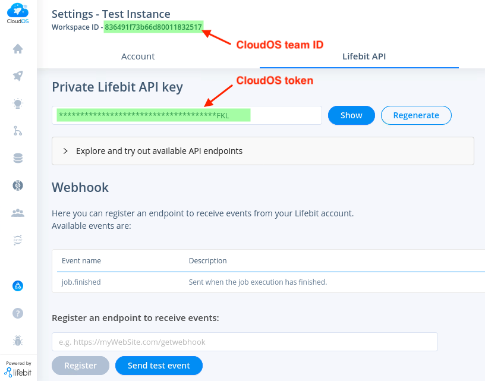

# cloudos

__Date:__ 2022-07-12\
__Version:__ 0.1.1


Python package for interacting with CloudOS

## Requirements

The package requires Python >= 3.8 and the following python packages:

```
click
requests
pandas
```

## Installation

### Docker image
It is recommended to install it as a docker image using the `Dockerfile`
and the `environment.yml` files provided.

To run the existing docker image at `quay.io`:

```bash
docker run --rm -it quay.io/lifebitaiorg/cloudos-py:v0.1.1
```

### From Github

You will need Python >= 3.8 and pip installed.

Clone the repo and install it using pip:

```bash
git clone https://github.com/lifebit-ai/cloudos-py
cd cloudos-py
pip install -r requirements.txt
pip install .
```

## Usage

The package is meant to be used both as a CLI tool and as a regular package to
import to your own scripts.

### Usage as a Command Line Interface tool

To get general information about the tool:

```bash
cloudos --help
```
```console
Usage: cloudos [OPTIONS] COMMAND [ARGS]...

  CloudOS python package: a package for interacting with CloudOS.

Options:
  --version  Show the version and exit.
  --help     Show this message and exit.

Commands:
  cromwell  Cromwell server functionality: check status, start and stop.
  job       CloudOS job functionality: run and check jobs in CloudOS.
  workflow  CloudOS workflow functionality: list workflows in CloudOS.
``` 

This will tell you the implemented commands. Each implemented command has its
own subcommands with its own `--help`:

```bash
cloudos job run --help
```
```console
CloudOS python package: a package for interacting with CloudOS.

Version: 0.1.1

CloudOS job functionality: run and check jobs in CloudOS.

Usage: cloudos job run [OPTIONS]

  Submit a job to CloudOS.

Options:
  -k, --apikey TEXT            Your CloudOS API key  [required]
  -c, --cloudos-url TEXT       The CloudOS url you are trying to access to.
                               Default=https://cloudos.lifebit.ai.
  --workspace-id TEXT          The specific CloudOS workspace id.  [required]
  --project-name TEXT          The name of a CloudOS project.  [required]
  --workflow-name TEXT         The name of a CloudOS workflow or pipeline.
                               [required]
  --job-config TEXT            A config file similar to a nextflow.config
                               file, but only with the parameters to use with
                               your job.
  -p, --nextflow-profile TEXT  A comma separated string indicating the
                               nextflow profile/s to use with your job.
  --git-commit TEXT            The exact whole 40 character commit hash to run
                               for the selected pipeline. If not specified it
                               defaults to the last commit of the default
                               branch.
  --git-tag TEXT               The tag to run for the selected pipeline. If
                               not specified it defaults to the last commit of
                               the default branch.
  --job-name TEXT              The name of the job. Default=new_job.
  --resumable                  Whether to make the job able to be resumed or
                               not.
  --batch                      Whether to make use the batch executor instead
                               of the default ignite.
  --instance-type TEXT         The type of AMI to use. Default=c5.xlarge.
  --instance-disk INTEGER      The amount of disk storage to configure.
                               Default=500.
  --spot                       Whether to make a spot instance.
  --storage-mode TEXT          Either 'lustre' or 'regular'. Indicates if the
                               user wants to select regular or lustre storage.
                               Default=regular.
  --lustre-size INTEGER        The lustre storage to be used when --storage-
                               mode=lustre, in GB. It should be 1200 or a
                               multiple of it. Default=1200.
  --wait-completion            Whether to wait to job completion and report
                               final job status.
  --wait-time INTEGER          Max time to wait (in seconds) to job
                               completion. Default=3600.
  --verbose                    Whether to print information messages or not.
  --help                       Show this message and exit.
```

#### Send a job to CloudOS

First, configure your local environment to ease parameters input. We will
try to submit a small toy example already available.

```bash
MY_API_KEY="xxxxx"
CLOUDOS="https://cloudos.lifebit.ai"
WORKSPACE_ID="xxxxx"
PROJECT_NAME="API jobs"
WORKFLOW_NAME="rnatoy"
JOB_PARAMS="cloudos/examples/rnatoy.config"
```

As you can see, a file with the job parameters is required to configure the
job. This file could be a regular `nextflow.config` file or any file with the
following structure:

```
params {
    reads   = s3://lifebit-featured-datasets/pipelines/rnatoy-data
    genome  = s3://lifebit-featured-datasets/pipelines/rnatoy-data/ggal_1_48850000_49020000.Ggal71.500bpflank.fa
    annot   = s3://lifebit-featured-datasets/pipelines/rnatoy-data/ggal_1_48850000_49020000.bed.gff
}
```

To submit our job:

```bash
cloudos job run \
    --cloudos-url $CLOUDOS \
    --apikey $MY_API_KEY \
    --workspace-id $WORKSPACE_ID \
    --project-name "$PROJECT_NAME" \
    --workflow-name $WORKFLOW_NAME \
    --job-config $JOB_PARAMS \
    --resumable \
    --spot
```

If everything went well, you should see something like:

```console
CloudOS python package: a package for interacting with CloudOS.

Version: 0.1.1

CloudOS job functionality: run and check jobs in CloudOS.

Executing run...
	Job successfully launched to CloudOS, please check the following link: https://cloudos.lifebit.ai/app/jobs/62c83a1191fe06013b7ef355
	Your assigned job id is: 62c83a1191fe06013b7ef355
	Your current job status is: initializing
	To further check your job status you can either go to https://cloudos.lifebit.ai/app/jobs/62c83a1191fe06013b7ef355 or use the following command:
cloudos job status \
    --apikey $MY_API_KEY \
    --cloudos-url https://cloudos.lifebit.ai \
    --job-id 62c83a1191fe06013b7ef355
```

As you can see, the current status is `initializing`. This will change
while the job progresses. To check the status, just apply the suggested
command.

Another option is to set the `--wait-completion` parameter, which run the same
job run command but waiting for its completion:

```bash
cloudos job run \
    --cloudos-url $CLOUDOS \
    --apikey $MY_API_KEY \
    --workspace-id $WORKSPACE_ID \
    --project-name "$PROJECT_NAME" \
    --workflow-name $WORKFLOW_NAME \
    --job-config $JOB_PARAMS \
    --resumable \
    --spot \
    --wait-completion
```

If the job takes less than `--wait-time` (3600 seconds by default), the
previous command should have an output similar to:

```console
CloudOS python package: a package for interacting with CloudOS.

Version: 0.1.1

CloudOS job functionality: run and check jobs in CloudOS.

Executing run...
	Job successfully launched to CloudOS, please check the following link: https://cloudos.lifebit.ai/app/jobs/62c83a6191fe06013b7ef363
	Your assigned job id is: 62c83a6191fe06013b7ef363
	Please, wait until job completion or max wait time of 3600 seconds is reached.
	Your current job status is: initializing.
	Your current job status is: running.
	Your job took 420 seconds to complete successfully.
```

#### Check job status

To check the status of a submitted job, just use the suggested command:

```bash
cloudos job status \
    --apikey $MY_API_KEY \
    --cloudos-url $CLOUDOS \
    --job-id 62c83a1191fe06013b7ef355
```

The expected output should be something similar to:

```console
CloudOS python package: a package for interacting with CloudOS.

Version: 0.1.1

CloudOS job functionality: run and check jobs in CloudOS.

Executing status...
	Your current job status is: completed

	To further check your job status you can either go to https://cloudos.lifebit.ai/app/jobs/62c83a1191fe06013b7ef355 or repeat the command you just used.
```

#### Get a list of your jobs from a CloudOS workspace

You can get a summary of your last 30 submitted jobs in two different formats:

- CSV: this is a table with a minimum predefined set of columns by default, or all the
available columns using the `--all-fields` argument.
- JSON: all the available information from your jobs, in JSON format.

To get a list with your last 30 submitted jobs to a given workspace, in CSV format, use
the following command:

```bash
cloudos job list \
    --cloudos-url $CLOUDOS \
    --apikey $MY_API_KEY \
    --workspace-id $WORKSPACE_ID \
    --output-format csv \
    --all-fields
```

The expected output is something similar to:

```console
CloudOS python package: a package for interacting with CloudOS.

Version: 0.1.1

CloudOS job functionality: run and check jobs in CloudOS.

Executing list...
	Job list collected with a total of 30 jobs.
	Job list saved to joblist.csv
```

In addition, a file named `joblist.csv` is created.

To get the same information, but in JSON format, use the following command:

```bash
cloudos job list \
    --cloudos-url $CLOUDOS \
    --apikey $MY_API_KEY \
    --workspace-id $WORKSPACE_ID \
    --output-format json
```
```console
CloudOS python package: a package for interacting with CloudOS.

Version: 0.1.1

CloudOS job functionality: run and check jobs in CloudOS.

Executing list...
	Job list collected with a total of 30 jobs.
	Job list saved to joblist.json
```

#### Get a list of all available workflows from a CloudOS workspace

You can get a summary of all the available workspace workflows in two different formats:
- CSV: this is a table with a minimum predefined set of columns by default, or all the
available columns using the `--all-fields` parameter.
- JSON: all the available information from workflows, in JSON format.

To get a CSV table with all the available workflows for a given workspace, use
the following command:

```bash
cloudos workflow list \
    --cloudos-url $CLOUDOS \
    --apikey $MY_API_KEY \
    --workspace-id $WORKSPACE_ID \
    --output-format csv \
    --all-fields
```

The expected output is something similar to:

```console
CloudOS python package: a package for interacting with CloudOS.

Version: 0.1.1

CloudOS workflow functionality: list workflows in CloudOS.

Executing list...
	Workflow list collected with a total of 609 workflows.
	Workflow list saved to workflow_list.csv
```

To get the same information, but in JSON format, use the following command:

```bash
cloudos workflow list \
    --cloudos-url $CLOUDOS \
    --apikey $MY_API_KEY \
    --workspace-id $WORKSPACE_ID \
    --output-format json
```

```console
CloudOS python package: a package for interacting with CloudOS.

Version: 0.1.1

CloudOS workflow functionality: list workflows in CloudOS.

Executing list...
	Workflow list collected with a total of 609 workflows.
	Workflow list saved to workflow_list.json
```

### WDL pipeline support

#### Cromwell server managing

In order to run WDL pipelines, a Cromwell server in CloudOS should be running. This server can
be accessed to check its status, restart it or stop it, using the following commands:

```bash
# Cromwell server requires its particular token
CROMWELL_TOKEN="xxxx"

# Check Cromwell status
cloudos cromwell status \
    -c $CLOUDOS \
    -t $CROMWELL_TOKEN \
    --workspace-id $WORKSPACE_ID
```

```console
CloudOS python package: a package for interacting with CloudOS.

Version: 0.1.1

Cromwell server functionality: check status, start and stop.

Executing status...
	Current Cromwell server status is: Stopped
```


```bash    
# Cromwell start
cloudos cromwell start \
    -c $CLOUDOS \
    -t $CROMWELL_TOKEN \
    --workspace-id $WORKSPACE_ID
```

```console
CloudOS python package: a package for interacting with CloudOS.

Version: 0.1.1

Cromwell server functionality: check status, start and stop.

Starting Cromwell server...
	Current Cromwell server status is: Initializing

	Current Cromwell server status is: Running
```

```bash
# Cromwell stop
cloudos cromwell stop \
    -c $CLOUDOS \
    -t $CROMWELL_TOKEN \
    --workspace-id $WORKSPACE_ID
```

```console
CloudOS python package: a package for interacting with CloudOS.

Version: 0.1.1

Cromwell server functionality: check status, start and stop.

Stopping Cromwell server...
	Current Cromwell server status is: Stopped
```

### Import the functionality to your own python scripts

To illustrate how to import the package and use its functionality inside
your own python scripts, we will perform a job submission and check its
status from inside a python script.

Again, we will set up the environment to ease the work:

```python
import cloudos.jobs.job as jb
import json


# GLOBAL VARS.
apikey = 'xxxxx'
cromwell_token = 'xxxx'
cloudos_url = 'https://cloudos.lifebit.ai'
workspace_id = 'xxxxx'
project_name = 'API jobs'
workflow_name = 'rnatoy'
job_config = 'cloudos/examples/rnatoy.config'
```

First, create the `Job` object:

```python
j = jb.Job(cloudos_url, apikey, cromwell_token, workspace_id, project_name, workflow_name)
print(j)
```

Then, send the job:

```python
j_id = j.send_job(job_config)
```

To check the status:

```python
j_status = j.get_job_status(j_id)
j_status_h = json.loads(j_status.content)["status"]
print(j_status_h)
```

The status will change while your job progresses, so to check again just
repeat the above code.

You can also collect your last 30 submitted jobs for a given workspace using the
following command.

```python
my_jobs_r = j.get_job_list(workspace_id)
my_jobs = j.process_job_list(my_jobs_r)
print(my_jobs)
```

Or inspect all the available workflows for a given workspace using the
following command.

```python
my_workflows_r = j.get_workflow_list(workspace_id)
my_workflows = j.process_workflow_list(my_workflows_r)
print(my_workflows)
```

#### Running WDL pipelines using your own scripts

You can even run WDL pipelines. First check the Cromwell server status and restart it if Stopped:

```python
import cloudos.clos as cl
import json


# GLOBAL VARS.
apikey = 'xxxxx'
cromwell_token = 'xxxx'
cloudos_url = 'https://cloudos.lifebit.ai'
workspace_id = 'xxxxx'

# First create cloudos object
cl = cl.Cloudos(cloudos_url, apikey, cromwell_token)

# Then, check Cromwell status
c_status = cl.get_cromwell_status(workspace_id)
c_status_h = json.loads(c_status.content)["status"]
print(c_status_h)

# Start Cromwell server
cl.cromwell_switch(workspace_id, 'restart')

# Check again Cromwell status (wait until status: 'Running')
c_status = cl.get_cromwell_status(workspace_id)
c_status_h = json.loads(c_status.content)["status"]
print(c_status_h)

# Stop Cromwell server
cl.cromwell_switch(workspace_id, 'stop')

# Check again Cromwell status
c_status = cl.get_cromwell_status(workspace_id)
c_status_h = json.loads(c_status.content)["status"]
print(c_status_h)
```

### unit testing

Unit tests require 3 additional packages:

```
requests-mock
pandas
pytest
```

Currently the Clos class function process_job_list and the Job class convert_nextflow_to_json are tested. To run untests run 

```
python -m pytest -s -v
``` 

from the cloudos-py main folder and 7 tests should pass. 

## CohortBrowser worked example

### Load the library

Navigate to the root folder of the cloudos-py package and run cloudos-py from here. Initially, we will be importing the two main classes. These are Cohort (used to manage cohorts) and CohortBrowser (used to analyse a cohort). There are two other classes (Query and PhenoFilter) which are used for making a query of phenotypes in CloudOs and we will introduce them later.

``` python
from cloudos.cohorts import Cohort, CohortBrowser
```

### Configure CloudOS

This package is primarily a means of communicating with a CloudOS instance using its API. This is done through the CohortBrowser and Cohort classes. Before it can  communicate with the CloudOS instance, the package must be configured with some key information:
- The CloudOS base URL. This is the URL in your browser when you navigate to the Cohort Browser in CloudOS. Often of the form `https://my_instance.lifebit.ai/app/cohort-browser`.
- The CloudOS token. Navigate to the settings page in CloudOS to generate an API key you can use as your token (see image below).
- The CloudOS team ID. Also found in the settings page in CloudOS labelled as the "Workspace ID" (see image below).



Save this information in variables that we can use to create a `CohortBrowser` object:

```python
>>> apikey = '***'
>>> workspace_id = '***'
>>> cloudos_url = "***"
```
To make a `CohortBrowser` object:

```python
>>> cb = CohortBrowser(apikey, cloudos_url, workspace_id)
```

### List Cohorts

To check list of available cohorts in a workspace use `list_cohorts()` from the `CohortBrowser` object. This will
provide a dictionary of cohorts. By default 10 are shown this can be varied with the `size` argument. To get all cohorts use `size=all`.

```python
>>> cohorts = cb.list_cohorts()
Total number of cohorts found: 115.
Showing 10 by default. Change 'size' parameter to return more.
>>> print(cohorts)
[{'_id': '6267e400bf19bc13dc2de40b', 'name': 'phenotype cohort', 'description': '', 'numberOfParticipants': 44756, 'createdAt': '2022-04-26T12:22:24.361Z', 'updatedAt': '2022-04-26T12:22:24.361Z', 'numberOfFilters': 0}, {'_id': '6267b5cbbf19bc13dc2dd651', 'name': 'diego test', 'numberOfParticipants': 36029, 'createdAt': '2022-04-26T09:05:15.129Z', 'updatedAt': '2022-04-29T09:34:29.790Z', 'numberOfFilters': 1}, {'_id': '6262bca5bf19bc13dc2dac2d', 'name': 'QA.Test.005.1', 'description': 'QA', 'numberOfParticipants': 44755, 'createdAt': '2022-04-22T14:33:09.484Z', 'updatedAt': '2022-04-22T14:33:09.484Z', 'numberOfFilters': 0}, {'_id': '6262bc91bf19bc13dc2dac2c', 'name': 'QA.Test.005', 'description': 'QA', 'numberOfParticipants': 44755, 'createdAt': '2022-04-22T14:32:49.651Z', 'updatedAt': '2022-04-22T14:32:49.651Z', 'numberOfFilters': 0}, {'_id': '6262baf8bf19bc13dc2dac21', 'name': 'QA.Test.006', 'description': 'qa', 'numberOfParticipants': 44755, 'createdAt': '2022-04-22T14:26:00.104Z', 'updatedAt': '2022-04-22T14:26:00.104Z', 'numberOfFilters': 0}, {'_id': '6262b6fdbf19bc13dc2dabfe', 'name': 'QA.Test.009', 'description': 'QA', 'numberOfParticipants': 44755, 'createdAt': '2022-04-22T14:09:01.461Z', 'updatedAt': '2022-04-22T14:09:01.461Z', 'numberOfFilters': 0}, {'_id': '6262b6e0bf19bc13dc2dabfc', 'name': 'QA.Test.008', 'description': 'QA', 'numberOfParticipants': 44755, 'createdAt': '2022-04-22T14:08:32.299Z', 'updatedAt': '2022-04-22T14:08:32.299Z', 'numberOfFilters': 0}, {'_id': '6262b6cebf19bc13dc2dabf8', 'name': 'QA.Test.007', 'numberOfParticipants': 44755, 'createdAt': '2022-04-22T14:08:14.966Z', 'updatedAt': '2022-04-22T14:25:45.611Z', 'numberOfFilters': 0}, {'_id': '6256b29f9f5d720717d98f8d', 'name': 'long-format-cohort-test', 'numberOfParticipants': 44727, 'createdAt': '2022-04-13T11:23:11.791Z', 'updatedAt': '2022-04-13T20:24:22.085Z', 'numberOfFilters': 0}, {'_id': '62556ff506421f187f840a53', 'name': 'Export Cohort', 'numberOfParticipants': 11, 'createdAt': '2022-04-12T12:26:29.569Z', 'updatedAt': '2022-04-14T11:27:14.173Z', 'numberOfFilters': 1}]
```

### Create a cohort

`Cohort.create()` is used to create a new cohort. Every cohort needs a specific name, and you can give it a description, but this is optional. 

```python
>>> new_cohort = Cohort.create(apikey, cloudos_url, workspace_id, cohort_name="example cohort 2022", cohort_desc="Cohort made to demonstrate how to use cohort-py")
>>> print(new_cohort.cohort_id)
6273f57e9ca9580fd84b2c4f
>>> print(new_cohort.cohort_name)
example cohort 2022
```

### Get a cohort

Get an available cohort in a Cohort class. This can be done using either `cohort_id` (the hash index of the cohort) or `cohort_name` (the name we gave the cohort). This cohort object can be used in many different other functions.

```python
>>> cohort_id =  '61cbd1c5b948af25c65ef7d0'
>>> other_cohort = Cohort.load(apikey, cloudos_url, workspace_id, cohort_id=cohort_id)
>>> print(other_cohort.cohort_name)
test1222
```

For convenience, a cohort can be created or loaded from a `CohortBrowser` object so that cloudos configuration information does not need to be explicitly passed each time a cohort is made or loaded. E.g. `cb.create_cohort(cohort_name="example cohort 2022")` or `cb.load_cohort('6273f57e9ca9580fd84b2c4f')`.

### Explore available phenotypes

#### Search phenotypes

Search for phenotypes based on a term using the CohortBrowser class. Searching with `term = ""` will return all the available phenotypes. By default, this will provide a summary of the metadata but all the metadata can be accessed by setting `all_metadata` to `True`.

```python
>>> disease_phenotypes = cb.search_phenotypes('disease')
Total number of phenotypes found - 2
>>> print(disease_phenotypes)
[{'display': 'dropdown', 'possibleValues': [{'key': 'Primary', 'label': 'Primary', 'array': 0}, {'key': 'Metastasis', 'label': 'Metastasis', 'array': 1}, {'key': 'Relapse (Local / Regional / Distant)', 'label': 'Relapse (Local / Regional / Distant)', 'array': 2}], 'clinicalForm': 'cancerForm', 'categoryPathLevel1': 'Cancer diagnosis', 'categoryPathLevel2': 'Secondary/Multifocal cancer condition', 'id': 33, 'instances': 1, 'name': 'Disease Type', 'type': 'bars', 'Sorting': '', 'valueType': 'Categorical single', 'units': '', 'coding': '', 'description': '', 'descriptionParticipantsNo': 'Not provided', 'link': '', 'array': 100, 'descriptionCategoryID': '', 'descriptionItemType': '', 'descriptionStrata': '', 'descriptionSexed': ''}, {'display': 'radioButtonWithClear', 'possibleValues': [{'key': 'Yes', 'label': 'Yes'}, {'key': 'No', 'label': 'No'}, {'key': 'Uncertain', 'label': 'Uncertain'}], 'clinicalForm': 'cancerForm', 'categoryPathLevel1': 'Cancer diagnosis', 'categoryPathLevel2': 'Radiological Findings', 'id': 69, 'instances': 1, 'name': 'Evidence of disease', 'type': 'bars', 'Sorting': '', 'valueType': 'Categorical single', 'units': '', 'coding': '', 'description': '', 'descriptionParticipantsNo': 'Not provided', 'link': '', 'array': 100, 'descriptionCategoryID': '', 'descriptionItemType': '', 'descriptionStrata': '', 'descriptionSexed': ''}]
```

With `all_metadata=True` the output looks like this:

```python
>>> disease_fulldata = cb.search_phenotypes('disease', all_metadata=True)
Total number of phenotypes found - 2
>>> print(disease_fulldata)
[{'_id': '6272993454e1b46398ea1179', 'display': 'dropdown', 'possibleValues': [{'key': 'Primary', 'label': 'Primary', 'array': 0}, {'key': 'Metastasis', 'label': 'Metastasis', 'array': 1}, {'key': 'Relapse (Local / Regional / Distant)', 'label': 'Relapse (Local / Regional / Distant)', 'array': 2}], 'clinicalForm': 'cancerForm', 'bucket500': False, 'bucket1000': False, 'bucket2500': False, 'bucket5000': False, 'bucket300': False, 'bucket10000': False, 'categoryPathLevel1': 'Cancer diagnosis', 'categoryPathLevel2': 'Secondary/Multifocal cancer condition', 'id': 33, 'instances': 1, 'name': 'Disease Type', 'type': 'bars', 'Sorting': '', 'valueType': 'Categorical single', 'units': '', 'coding': '', 'description': '', 'descriptionParticipantsNo': 'Not provided', 'link': '', 'array': 100, 'descriptionCategoryID': '', 'descriptionItemType': '', 'descriptionStrata': '', 'descriptionSexed': '', 'orderPhenotype': '', 'instance0Name': '', 'instance1Name': '', 'instance2Name': '', 'instance3Name': '', 'instance4Name': '', 'instance5Name': '', 'instance6Name': '', 'instance7Name': '', 'instance8Name': '', 'instance9Name': '', 'instance10Name': '', 'instance11Name': '', 'instance12Name': '', 'instance13Name': '', 'instance14Name': '', 'instance15Name': '', 'instance16Name': ''}, {'_id': '6272993454e1b46398ea11a3', 'display': 'radioButtonWithClear', 'possibleValues': [{'key': 'Yes', 'label': 'Yes'}, {'key': 'No', 'label': 'No'}, {'key': 'Uncertain', 'label': 'Uncertain'}], 'clinicalForm': 'cancerForm', 'bucket500': False, 'bucket1000': False, 'bucket2500': False, 'bucket5000': False, 'bucket300': False, 'bucket10000': False, 'categoryPathLevel1': 'Cancer diagnosis', 'categoryPathLevel2': 'Radiological Findings', 'id': 69, 'instances': 1, 'name': 'Evidence of disease', 'type': 'bars', 'Sorting': '', 'valueType': 'Categorical single', 'units': '', 'coding': '', 'description': '', 'descriptionParticipantsNo': 'Not provided', 'link': '', 'array': 100, 'descriptionCategoryID': '', 'descriptionItemType': '', 'descriptionStrata': '', 'descriptionSexed': '', 'orderPhenotype': '', 'instance0Name': '', 'instance1Name': '', 'instance2Name': '', 'instance3Name': '', 'instance4Name': '', 'instance5Name': '', 'instance6Name': '', 'instance7Name': '', 'instance8Name': '', 'instance9Name': '', 'instance10Name': '', 'instance11Name': '', 'instance12Name': '', 'instance13Name': '', 'instance14Name': '', 'instance15Name': '', 'instance16Name': ''}]
```

Let’s choose a phenotype from the above table. The “id” is the most important part as it will allow us to use this phenotype for cohort queries and other functions.

```python
>>> print(disease_phenotypes[0])
{'display': 'dropdown', 'possibleValues': [{'key': 'Primary', 'label': 'Primary', 'array': 0}, {'key': 'Metastasis', 'label': 'Metastasis', 'array': 1}, {'key': 'Relapse (Local / Regional / Distant)', 'label': 'Relapse (Local / Regional / Distant)', 'array': 2}], 'clinicalForm': 'cancerForm', 'categoryPathLevel1': 'Cancer diagnosis', 'categoryPathLevel2': 'Secondary/Multifocal cancer condition', 'id': 33, 'instances': 1, 'name': 'Disease Type', 'type': 'bars', 'Sorting': '', 'valueType': 'Categorical single', 'units': '', 'coding': '', 'description': '', 'descriptionParticipantsNo': 'Not provided', 'link': '', 'array': 100, 'descriptionCategoryID': '', 'descriptionItemType': '', 'descriptionStrata': '', 'descriptionSexed': ''}
```

#### Exploring phenotypes

To get more information on a phenotype `get_phenotype_metadata` can be used.

```python
>>> pheno_id = '4'
>>> pheno_metadata = cb.get_phenotype_metadata(pheno_id)
>>> print(pheno_metadata)
{'display': 'dropdown', 'possibleValues': [{'key': 'Male', 'label': 'Male'}, {'key': 'Female', 'label': 'Female'}, {'key': 'Prefer not to say', 'label': 'Prefer not to say'}], 'clinicalForm': 'MainForm', 'bucket500': False, 'bucket1000': False, 'bucket2500': False, 'bucket5000': False, 'bucket300': False, 'bucket10000': False, 'categoryPathLevel1': 'Main form data', 'id': 4, 'instances': 1, 'name': 'Sex', 'type': 'bars', 'Sorting': '', 'valueType': 'Categorical multiple', 'units': '', 'coding': '', 'description': '', 'descriptionParticipantsNo': 'Not provided', 'link': '', 'array': 1, 'descriptionCategoryID': '', 'descriptionItemType': '', 'descriptionStrata': '', 'descriptionSexed': '', 'orderPhenotype': '', 'instance0Name': '', 'instance1Name': '', 'instance2Name': '', 'instance3Name': '', 'instance4Name': '', 'instance5Name': '', 'instance6Name': '', 'instance7Name': '', 'instance8Name': '', 'instance9Name': '', 'instance10Name': '', 'instance11Name': '', 'instance12Name': '', 'instance13Name': '', 'instance14Name': '', 'instance15Name': '', 'instance16Name': ''}
>>> 
```

### Update a cohort with a new query

A query defines what participants are included in a cohort based on phenotypes. These are made using the `Query` class and a cohort can be filtered using the `PhenoFilter` class. We can get a preview of this by using `preview_participant_count()` and setting `keep_query` to `False`. To get all participants use `None` instead of a Query object.


```python
from cloudos.cohorts import Query, PhenoFilter

>>> cb = CohortBrowser(apikey, cloudos_url, workspace_id)
>>> cohort = cb.load_cohort('6273f57e9ca9580fd84b2c4f')
>>> cohort.preview_participant_count(None, keep_query=False)
{'count': 44765, 'meta': {'relationalSearch': False, 'reason': 'The tryRelationalSearch parameter was not specified'}, 'total': 44765}
```

Phenotypes can be continuous - in which case a selected range needs to be specified, or they can be categorical - in which case selected categories need to be specified.

#### Continuous phenotype

For phenotype “Year of birth” (with id = 8)

```python
>>> continuous_query = PhenoFilter(pheno_id=8, vals_min=1965, vals_max=1995)
>>> cohort.preview_participant_count(continuous_query, keep_query=False)
{'count': 20778, 'meta': {'relationalSearch': False, 'reason': 'The tryRelationalSearch parameter was not specified'}, 'total': 44765}
```

#### Categorical phenotype

For phenotype “Total full brothers” (with id = 48)

```python
>>> categorical_query = PhenoFilter(pheno_id=48, vals=[1])
>>> cohort.preview_participant_count(categorical_query, keep_query=False)
{'count': 7791, 'meta': {'relationalSearch': False, 'reason': 'The tryRelationalSearch parameter was not specified'}, 'total': 44765}
```

To combine single phenotype queries, you can use `&`, `|` and `!` operators.

```python
>>> query = categorical_query & continuous_query
>>> cohort.preview_participant_count(query, keep_query=False)
{'count': 2524, 'meta': {'relationalSearch': False, 'reason': 'The tryRelationalSearch parameter was not specified'}, 'total': 44765}
```

Any number of single phenotypes can be combined using any combination of operators. The order in which logic is resolved follows the usual rules and can be controlled using brackets.

```python
>>> categorical_query_2 = PhenoFilter(pheno_id=48, vals=[2])
>>> query = (categorical_query | categorical_query_2) & continuous_query
>>> cohort.preview_participant_count(query, keep_query=False)
{'count': 2883, 'meta': {'relationalSearch': False, 'reason': 'The tryRelationalSearch parameter was not specified'}, 'total': 44765}
```

If we’re happy that this is a sensible query to apply, we can apply the query to the cohort, making sure to override the previous query by setting `keep_query` to `FALSE`. If we wanted to keep the criteria from the pre-existing query and add our new phenotype-based criteria to them we would leave `keep_query` set to the default value of `TRUE`. 

```python
>>> new_query = PhenoFilter(10, vals=["Female"])
>>> cohort.apply_query(query=new_query)
>>> cohort.query
Query('AND', [
    PhenoFilter(pheno_id=10, vals=['Female'])
])
>>> cohort.preview_participant_count()
{'count': 23741, 'meta': {'relationalSearch': False, 'reason': 'The tryRelationalSearch parameter was not specified'}, 'total': 44765}
```

### Retrieve the participant table

After the cohort has been suitably queried a participant phenotype table can be reviewed. Participants in cloudos are held in a paginated table. By default, all participants in the cohort are retrieved by iterating through all pages. The page size (number of participants to display) can be changed with `page_size`, and if a specific page is wanted it can be specified with `page_number`.

```python
>>> df = cb.get_participants_table(cols=None, page_size=100, page_number=0)
Warning: values in the column "Maternal age during pregnancy (years)" do not fit the data type (Int64) specified in the Cohort Browser metadata. Leaving data type as `object`.
>>> print(df)
          i            Sex  ... Perinatal complications Method of diagnosis
0   1000020  Rare Diseases  ...                 Unknown            Relative
1   1000035  Rare Diseases  ...            Not Supplied            Relative
2   1000061  Rare Diseases  ...            Not Supplied            Relative
3   1000232         Cancer  ...                     NaN                 NaN
4   1000233  Rare Diseases  ...            Not Supplied             Proband
..      ...            ...  ...                     ...                 ...
95  1005097  Rare Diseases  ...                 Unknown             Proband
96  1005143         Cancer  ...                     NaN                 NaN
97  1005244  Rare Diseases  ...                 Unknown            Relative
98  1005270  Rare Diseases  ...            Not Supplied             Proband
99   100529  Rare Diseases  ...            Not Supplied            Relative

[100 rows x 7 columns]
```

### Customising the phenotype display.

Sometimes we might want to add or remove columns to make it easier to analyse the phenotypes. This can be done using `set_columns`. This takes a list of phenotypes and can either replace the existing columns in a cohort, or append these phenotypes to the existing columns (`append=True`).

Lets replace the old columns with the columns we're interested in.
```python
>>> columns = [12,56]
>>> cohort.set_columns(cols=columns, append=False)
>>> cohort.columns
[{'field': {'_id': '6272993454e1b46398ea1169', 'display': 'dropdown', 'possibleValues': [{'key': 'Current everyday smoker', 'label': 'Current everyday smoker'}, {'key': 'Current some day smoker', 'label': 'Current some day smoker'}, {'key': 'Former smoker', 'label': 'Former smoker'}, {'key': 'Never smoke', 'label': 'Never smoke'}], 'clinicalForm': 'MainForm', 'bucket500': False, 'bucket1000': False, 'bucket2500': False, 'bucket5000': False, 'bucket300': False, 'bucket10000': False, 'categoryPathLevel1': 'Main form data', 'id': 12, 'instances': 1, 'name': 'Smoking status', 'type': 'bars', 'Sorting': '', 'valueType': 'Categorical multiple', 'units': '', 'coding': '', 'description': '', 'descriptionParticipantsNo': 'Not provided', 'link': '', 'array': 1, 'descriptionCategoryID': '', 'descriptionItemType': '', 'descriptionStrata': '', 'descriptionSexed': '', 'orderPhenotype': '', 'instance0Name': '', 'instance1Name': '', 'instance2Name': '', 'instance3Name': '', 'instance4Name': '', 'instance5Name': '', 'instance6Name': '', 'instance7Name': '', 'instance8Name': '', 'instance9Name': '', 'instance10Name': '', 'instance11Name': '', 'instance12Name': '', 'instance13Name': '', 'instance14Name': '', 'instance15Name': '', 'instance16Name': ''}, 'instance': '0', 'array': {'type': 'exact', 'value': 0}}, {'field': {'_id': '6272993454e1b46398ea1196', 'display': 'dropdown', 'possibleValues': [{'key': 'Core', 'label': 'Core'}, {'key': 'Needle', 'label': 'Needle'}, {'key': 'Resection', 'label': 'Resection'}, {'key': 'Whole blood', 'label': 'Whole blood'}], 'clinicalForm': 'cancerForm', 'bucket500': False, 'bucket1000': False, 'bucket2500': False, 'bucket5000': False, 'bucket300': False, 'bucket10000': False, 'categoryPathLevel1': 'Cancer diagnosis', 'categoryPathLevel2': 'Genetic findings', 'id': 56, 'instances': 1, 'name': 'Type of biopsy', 'type': 'bars', 'Sorting': '', 'valueType': 'Categorical single', 'units': '', 'coding': '', 'description': '', 'descriptionParticipantsNo': 'Not provided', 'link': '', 'array': 100, 'descriptionCategoryID': '', 'descriptionItemType': '', 'descriptionStrata': '', 'descriptionSexed': '', 'orderPhenotype': '', 'instance0Name': '', 'instance1Name': '', 'instance2Name': '', 'instance3Name': '', 'instance4Name': '', 'instance5Name': '', 'instance6Name': '', 'instance7Name': '', 'instance8Name': '', 'instance9Name': '', 'instance10Name': '', 'instance11Name': '', 'instance12Name': '', 'instance13Name': '', 'instance14Name': '', 'instance15Name': '', 'instance16Name': ''}, 'instance': '0', 'array': {'type': 'all', 'value': 0}}]
>>> df = cb.get_participants_table(cols=None, page_size=100, page_number=0)
>>> print(df)
          i Smoking status       Type of biopsy
0   1000020           Male           [Adult R1]
1   1000035         Female           [Adult R1]
2   1000061           Male           [Adult R1]
3   1000232         Female           [Adult C1]
4   1000233           Male  [Deceased Child R6]
..      ...            ...                  ...
95  1005097         Female           [Adult R1]
96  1005143         Female           [Child C5]
97  1005244         Female           [Adult R1]
98  1005270         Female           [Child R5]
99   100529         Female           [Adult R1]

[100 rows x 3 columns]
```

Appending new columns to the columns we set.
```python
>>> col2 = [4]
>>> cohort.set_columns(cols=col2, append=True)
>>> df = cohort.get_participants_table(cols=None, page_size=100, page_number=0)
>>> print(df)
          i            Sex Smoking status       Type of biopsy
0   1000020  Rare Diseases           Male           [Adult R1]
1   1000035  Rare Diseases         Female           [Adult R1]
2   1000061  Rare Diseases           Male           [Adult R1]
3   1000232         Cancer         Female           [Adult C1]
4   1000233  Rare Diseases           Male  [Deceased Child R6]
..      ...            ...            ...                  ...
95  1005097  Rare Diseases         Female           [Adult R1]
96  1005143         Cancer         Female           [Child C5]
97  1005244  Rare Diseases         Female           [Adult R1]
98  1005270  Rare Diseases         Female           [Child R5]
99   100529  Rare Diseases         Female           [Adult R1]

[100 rows x 4 columns]
```